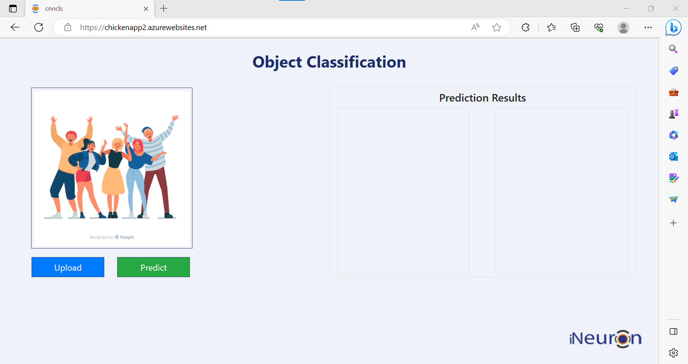
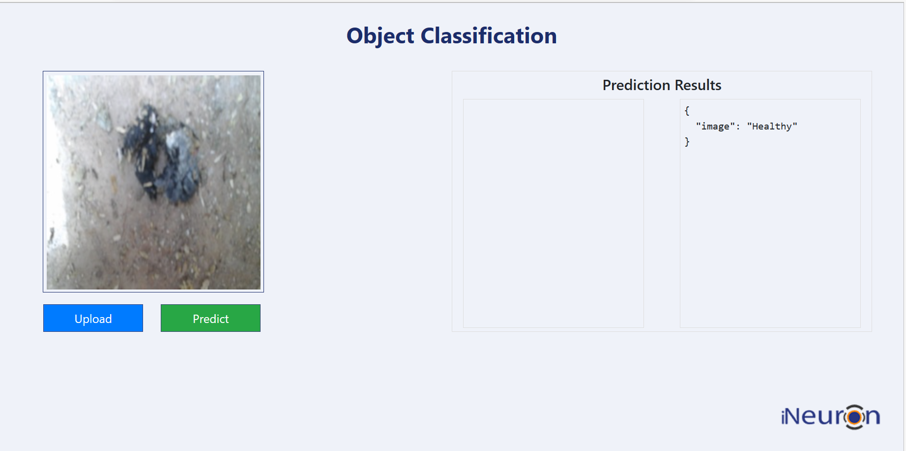
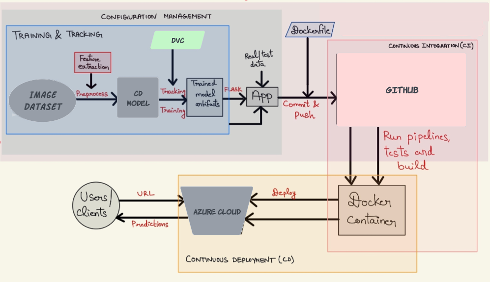

# Deploying an end-to-end chicken disease model into cloud server using Flask and Docker with CI/CD pipeline

This project focuses on the prediction of chicken diseases using an `end-to-end deep learning` approach, with the integration of `MLOps`, `DVC pipeline` , and `Azure` for deployments. The `pipeline` encompasses various stages, beginning with `data preprocessing`  and `feature extraction` from chicken health records. The deep learning model is `trained` on the processed data to predict the occurrence of chicken diseases accurately. Throughout the project, `MLOps` practices are employed to `track` and `log` experiments, including `model artifacts`, parameters, and metrics. The resulting model is then integrated into a web application, which is `containerized` using `Docker`. The final step involves `deploying` the application, along with the trained model, as a Docker container on Azure. The deployment process leverages `Azure`'s capabilities for `CI/CD integration`, `automated tests`, and `releases`, ensuring a robust and efficient management of the deployed chicken disease prediction system.

## Author

- [@Hamza Jakouk](https://www.github.com/hamzajakouk)

## Languages and Tools

<div align="">
<a href="https://www.python.org" target="_blank" rel="noreferrer"></a>
<a href="https://www.tensorflow.org" target="_blank" rel="noreferrer"></a>
<a href="https://www.docker.com/" target="_blank" rel="noreferrer"></a>
<a href="https://flask.palletsprojects.com/en/2.2.x/" target="_blank" rel="noreferrer"> </a>
<a href="https://github.com/features/actions" target="_blank" rel="noreferrer"> </a>
<a href="https://azure.microsoft.com/" target="_blank" rel="noreferrer"></a>
<a href="https://th.bing.com/th/id/R.82986e112ecefabbcfbaf960e2c8fb36?rik=SfIPu6t13UB87Q&pid=ImgRaw&r=0" target="_blank" rel="noreferrer"></a>
</div>

## Chicken Disease in Azure - Demo

_**Link**: Will be updated. Please check the `Disclaimer` below the screenshot for more !!!_

|  |
|:--:|
| <b>Figure 1a: App demo - Image input is provided to the application for predicting the health status of chickens using the trained model artifact.</b>|

|  |
|:--:|
| <b>Figure 1b: App demo - The application outputs the predicted health status of the chickens.</b>|

_**Disclaimer:**_ <br>
_1. This app is just a demo and not for realtime usage. The main objective is to get ML models into production in terms of deployment and CI/CD, from MLOps paradigm_. <br>
_2. Additionally, due to some technical issues in the Azure backend, the app currently crashes, so the app link is not provided as of now. It will be updated once the issues are solved and when the app is up and running_.
  
## Directory structure
```
├── artifacts
│   ├── data_ingestion
│   │   └── Chicken-fecal-images
│   │       ├── Coccidiosis
│   │       └── Healthy
│   ├── prepare_base_model
│   ├── prepare_callbacks
│   │   ├── checkpoint_dir
│   │   └── tensorboard_log_dir
│   │       ├── tb_logs_at_2023-06-16-13-56-16
│   │       │   ├── train
│   │       │   └── validation
│   │       └── tb_logs_at_2023-06-16-14-39-13
│   │           ├── train
│   │           └── validation
│   └── training
├── config
├── logs
├── research
├── src
│   ├── chicken.egg-info
│   ├── chicken_disease
│   │   ├── __pycache__
│   │   ├── components
│   │   │   └── __pycache__
│   │   ├── config
│   │   │   └── __pycache__
│   │   ├── constants
│   │   │   └── __pycache__
│   │   ├── entity
│   │   │   └── __pycache__
│   │   ├── pipeline
│   │   │   └── __pycache__
│   │   └── utils
│   │       └── __pycache__
│   ├── chicken_disease.egg-info
│   └── chicken_disease_model.egg-info
└── templates
```
## Motivation

`Deep learning/Machine learning` or `AI` (in short) is the current hot topic which has its application in most of the fields and it's demand is increasing day-by-day. But at this point, the sad truth is - `Only very less percentage of ML/DL models makes into production`. That's when `MLOps` comes into the picture. 

The major challenges with ML during development are:
  - Development, training and deployment environment can be different leading to dependency hassles.
  - Whenever input data changes, its becomes more tedious to reproduce the experiment.
  - Experiment tracking and analyzing can mostly be difficult and challenging.
  - Core ML code turn out to be spaghetti jungle which introduces lot of `boilerplate` codes.

MLOps is a budding field that productionalize ML models. `ML/DL` being a core research field, still misses out the `deployment` paradigm which includes design principles, patterns, testing, code styles etc. This restricts the domain to be used in the production environment efficiently. To nullify this, MLOps integrates DevOps principles into ML domain and serves as an intersection point of `Machine learning`, `Datascience` and `DevOps`.

## Description

The project is an end-to-end solution that focuses on predicting the health status of chickens based on fecal images. It encompasses various stages, including `data preprocessing`, image analysis, model training, and `deployment`. The fecal images are processed to extract relevant features and are used to train a deep learning model. The trained model is then `deployed` as part of a web application, which allows users to input fecal images and obtain predictions regarding the health status of the chickens. The project incorporates `CI/CD` pipelines for automated testing, releases, and continuous integration, ensuring efficient development and deployment processes.

|  |
|:--:|
| <b>Figure 2: Project Workflow - Deployment with CI/CD</b>|

## How to run?
### STEPS:

Clone the repository

```bash
https://github.com/hamzajakouk/chicken_disease_classification.git
```
### STEP 01- Create a conda environment after opening the repository

```bash
conda create -n cnncls python=3.8 -y
```

```bash
conda activate cnncls
```

### STEP 02- install the requirements
```bash
pip install -r requirements.txt
```


```bash
# Finally run the following command
python app.py
```

Now,
```bash
open up you local host and port
```


### DVC cmd

1. dvc init
2. dvc repro
3. dvc dag


## AWS-CICD-Deployment-with-Github-Actions

### 1. Login to AWS console.

### 2. Create IAM user for deployment

	#with specific access

	1. EC2 access : It is virtual machine

	2. ECR: Elastic Container registry to save your docker image in aws


	#Description: About the deployment

	1. Build docker image of the source code

	2. Push your docker image to ECR

	3. Launch Your EC2 

	4. Pull Your image from ECR in EC2

	5. Lauch your docker image in EC2

	#Policy:

	1. AmazonEC2ContainerRegistryFullAccess

	2. AmazonEC2FullAccess

	
### 3. Create ECR repo to store/save docker image
    - Save the URI: 566373416292.dkr.ecr.us-east-1.amazonaws.com/chicken

	
### 4. Create EC2 machine (Ubuntu) 

### 5. Open EC2 and Install docker in EC2 Machine:
	
	
	#optinal

	sudo apt-get update -y

	sudo apt-get upgrade
	
	#required

	curl -fsSL https://get.docker.com -o get-docker.sh

	sudo sh get-docker.sh

	sudo usermod -aG docker ubuntu

	newgrp docker
	
### 6. Configure EC2 as self-hosted runner:
    setting>actions>runner>new self hosted runner> choose os> then run command one by one


### 7. Setup github secrets:

    AWS_ACCESS_KEY_ID=

    AWS_SECRET_ACCESS_KEY=

    AWS_REGION = us-east-1

    AWS_ECR_LOGIN_URI = demo>>  566373416292.dkr.ecr.ap-south-1.amazonaws.com

    ECR_REPOSITORY_NAME = simple-app


## AZURE-CICD-Deployment-with-Github-Actions

### Save pass:

s3cEZKH5yytiVnJ3h+eI3qhhzf9q1vNwEi6+q+WGdd+ACRCZ7JD6


### Run from terminal:

docker build -t chickenapp.azurecr.io/chicken:latest .

docker login chickenapp.azurecr.io

docker push chickenapp.azurecr.io/chicken:latest


### Deployment Steps:

1. Build the Docker image of the Source Code
2. Push the Docker image to Container Registry
3. Launch the Web App Server in Azure 
4. Pull the Docker image from the container registry to Web App server and run 

